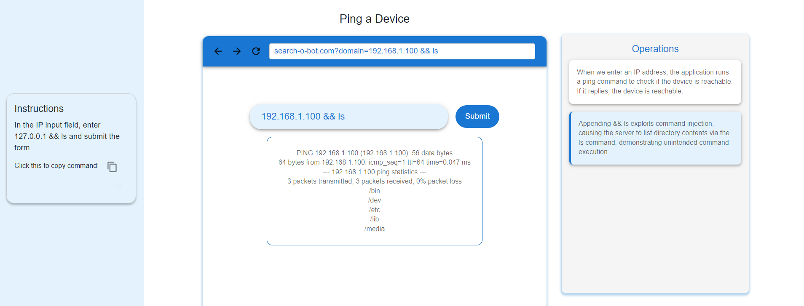

### Procedure

Step 1: Observe the instruction given in the simulation and click the arrow to move to the next step.

Step 2: Read the instruction. Here we are entering an IP address to check the device is Up or Down. Enter the command into the input field and click the submit button.

Step 3: Observe the result and read the explanation to understand how it works.

Step 4: Read the instruction. Here we are going to inject an `ls` command. Enter the command into the input field, click the submit button, and observe the result.

Step 5: Read the instruction. Here we are going to inject OS commands. Enter the command into the input field, click the submit button, and observe the result.

