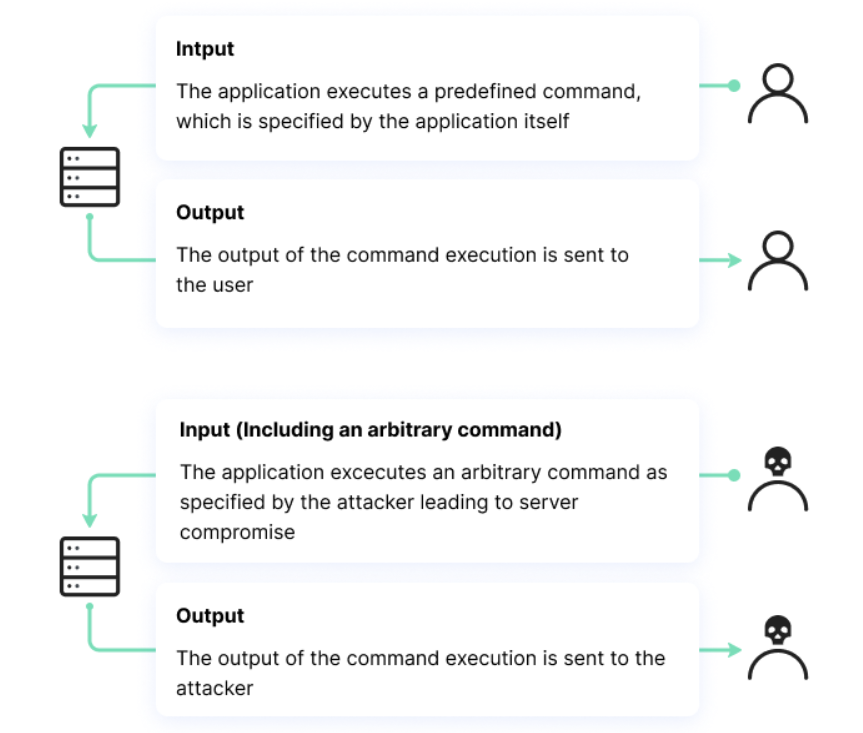

### Theory

OS Command Injection is a vulnerability that occurs when an application improperly processes user input, allowing an attacker to execute arbitrary system commands. This happens when user input is passed directly into system commands without proper validation or sanitization, potentially enabling unauthorized access to files, system configurations, and sensitive data.

#### Understanding OS Commands Used in Injection

1. **`ls` Command**  
The `ls` command lists files and directories within a specified location. If an application is vulnerable to command injection, an attacker can use `ls` to view system files that should not be accessible through the application.

2. **Chaining Commands for Injection**  
Attackers often exploit command injection by chaining multiple commands using operators like `&&`, `;`, or `|`.  

   - Example: `&& cat /etc/passwd` – If injected into a vulnerable input field, this command first executes the intended operation and then runs `cat /etc/passwd`, displaying system user information.  
   - Example: `; rm -rf /` – This could attempt to delete critical system files, potentially causing system failure.  

These examples demonstrate how improperly validated input fields can be used to execute harmful commands, highlighting the importance of input validation and secure coding practices.
