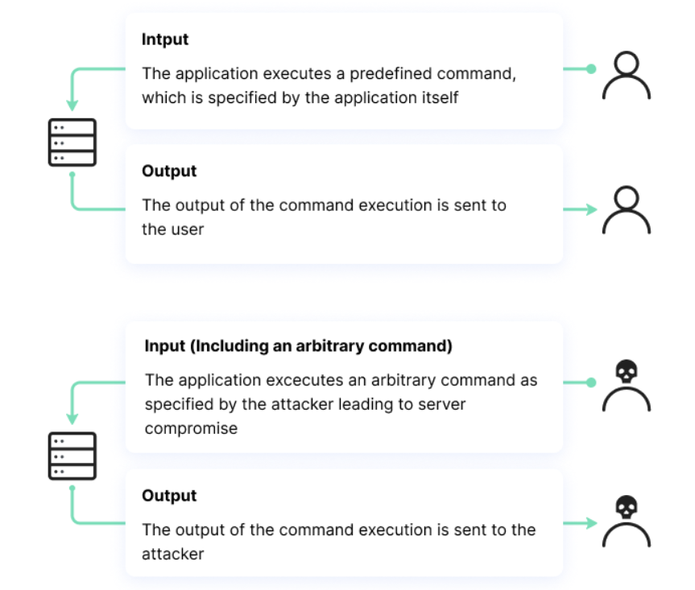

### Theory

OS Command Injection is a vulnerability that occurs when an application improperly processes user input, allowing an attacker to execute arbitrary system commands. This happens when user input is passed directly into system commands without proper validation or sanitization, enabling unauthorized access to files, system configurations, and sensitive data

<h5>Understanding OS Commands Used in Injection</h4>
<h5>1. ls Command</h5>

The ls command lists files and directories within a specified location. If an application is vulnerable to command injection, an attacker can input ls to view system files that should not be accessible through the application.

<h5>2. Chaining Commands for Injection</h5>

A common way attackers exploit command injection vulnerabilities is by chaining multiple commands using operators like &&, ;, or |. 

&& cat /etc/passwd – If injected into a vulnerable input field, this command first executes the intended operation and then runs cat /etc/passwd, which displays system user information.
; rm -rf / – This could attempt to delete critical files, leading to system failure.
Such attacks demonstrate how an improperly validated input field can be used to execute harmful commands.
